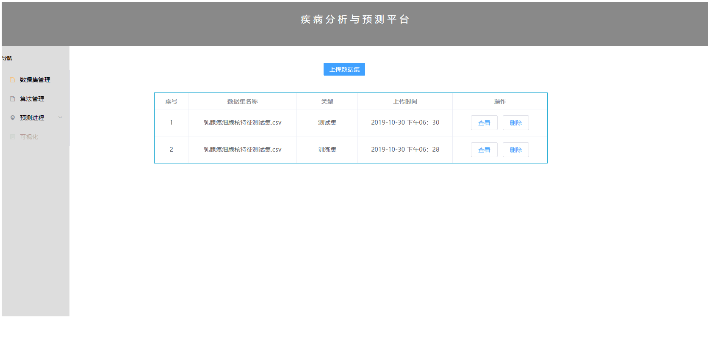
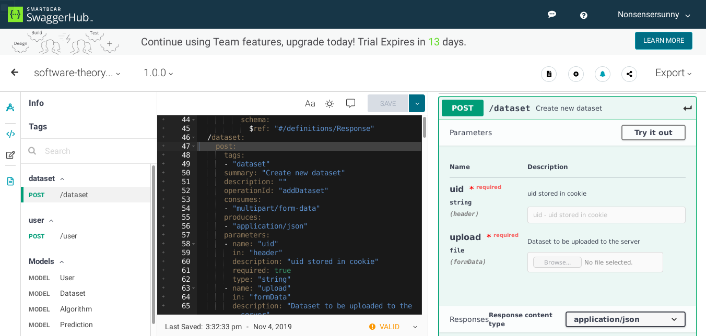
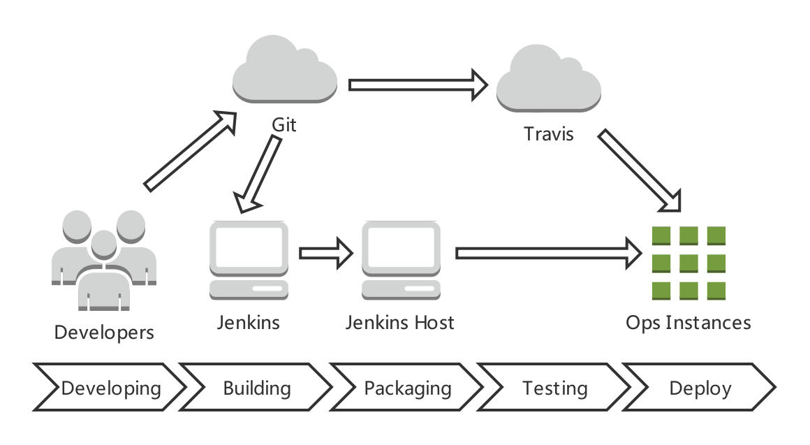
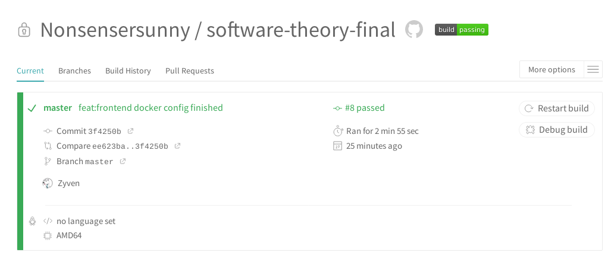
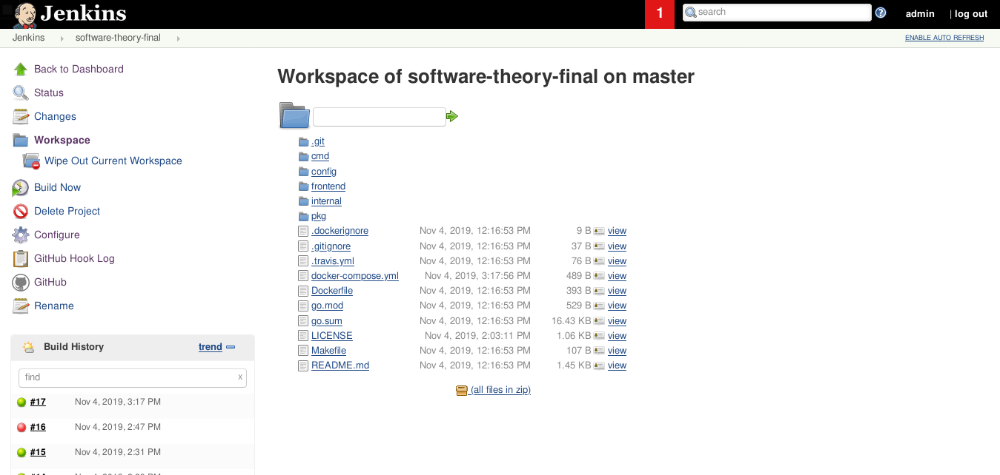

# software-theory-final

[](https://img.shields.io/github/go-mod/go-version/Nonsensersunny/software-theory-final)
[](https://travis-ci.com/Nonsensersunny/software-theory-final.svg?token=LEr1zMzLkAKxkNtGp9dY&branch=master)

### 1. 需求分析

#### 1.1 用例图


<center>图1. 用例图</center>
#### 1.2 数据字典

- User

  | 列名     | 类型    | 说明       |
  | :------- | ------- | ---------- |
  | id       | varchar | 用户存储ID |
  | mail     | varchar | 用户邮箱   |
  | password | varchar | 用户密码   |

- Algorithm

  | 列名        | 类型    | 说明         |
  | ----------- | ------- | ------------ |
  | id          | varchar | 算法存储ID   |
  | path        | varchar | 算法存储路径 |
  | description | varchar | 算法描述     |

- Dataset

  | 列名        | 类型    | 说明           |
  | ----------- | ------- | -------------- |
  | id          | varchar | 数据集存储ID   |
  | uid         | varchar | 用户ID（外键） |
  | path        | varchar | 数据集存储路径 |
  | description | varchar | 数据集描述     |
  | time        | time    | 数据集上传时间 |

- Prediction

  | 列名     | 类型    | 说明             |
  | -------- | ------- | ---------------- |
  | id       | varchar | 预测结果存储ID   |
  | aid      | varchar | 算法ID（外键）   |
  | did      | varchar | 数据集ID（外键） |
  | accuracy | float   | 预测结果准确度   |
  | path     | varchar | 测试集存储路径   |
  | result   | varchar | 预测结果         |
  | time     | time    | 预测操作时间     |

### 2. 后端REST规范

- 后端接口定义与测试均上传至 [SwaggerHub](https://app.swaggerhub.com/apis/B755/software-theory_final/1.0.0#/User)

### 3. 系统开发流程

#### 3.1 算法

略

#### 3.2 后端

系统后端采用 *Golang* 编写，框架采用了 *go-gin*，接口定义参照 *REST* 规范，接口定义与测试均采用了 *Swagger*，由于 *Golang* 特别适合工程构建，其目录层级可反映项目的基础架构：

```shell
├── cmd
│   └── main.go
├── config
│   ├── config.example.yaml
│   └── config.yaml
├── docker-compose.yml
├── Dockerfile
├── frontend
│   ├── algoplatform
│   └── Dockerfile
├── go.mod
├── go.sum
├── internal
│   ├── config
│   ├── log
│   ├── middleware
│   └── utils
├── LICENSE
├── Makefile
├── pkg
│   ├── modules
│   ├── rest
│   └── service
├── README.md
└── vendor
    ├── github.com
    ├── golang.org
    ├── google.golang.org
    ├── gopkg.in
    └── modules.txt
```

#### 3.3 前端

系统前端采用 *Vue* 框架进行开发，前端对后端发起 *AJAX* 异步请求对接口进行调用，而后端返回相应数据，利用 *Vue* 双向绑定等特性可以轻松改变网页视图，示例如下：



<center>图2. 前端示例</center>
#### 3.4 版本管理

本项目使用 *Git* 进行版本管理，项目的代码托管于[GitHub](https://github.com/Nonsensersunny/software-theory-final).

#### 3.5 接口测试

本项目的前后端分离开发，因此后端开发时利用 *Postman* 和 *Swagger* 进行本地和线上接口测试。示例如下，利用 *Swagger* 可对接口、协议、参数类型、返回字段进行描述并进行测试：



<center> 图3. Swagger部分接口示例</center>
#### 3.6 CI/CD

本项目采用了持续交付的软件开发流程，包括集成、测试与部署的自动化，基于 *Docker* 的构建流程，基于云服务的开发环境，*CI/DI* 流程图如下：



<center>图4. CI/CD 流程</center>
系统的部署图如下：


<center>图5. 部署图</center>
##### 3.6.1 Travis

*Travis* 是集成于 *GitHub* 中的一款开源的 *CI* 工具，可在项目的仓库中设置 *Travis* 配置，为项目添加触发器，例如本项目添加了 *Push* 操作的触发器，当项目的代码更新时，*Travis* 会自动 *Pull* 代码仓库中的代码并执行 *CI* 脚本，脚本的格式如下：

```yaml
# 指定项目的 build 环境
language: golang
# 为使用 docker 需要获取 sudo 权限
sudo: required
services:
  - docker
# deploy 服务阶段定义于 Makefile
script:
  - make deploy
```

*Travis* 的自动测试效果示例如下：



<center>图6. Travis 示例</center>
##### 3.6.2 Jenkins

同 *Travis* 类似，*Jenkins* 是另外一款开源的 *CI/CD* 工具，与 *Travis* 不同的是，*Jenkins* 的 *CI/CD* 服务基于插件，而 *Travis* 则是分布式的，因此 *Travis* 的设计理念更加先进，但 *Jenkins* 中有许多优秀的插件可以使用，本项目采用了基于 *Jenkins* 的 *docker-compose* 进行多阶段服务构建和自动部署，构建效果如下：



<center>图7. Jenkins 示例</center>
##### 3.6.3 Docker

项目的 *CI/CD* 采用了 *Docker* 以及容器编排工具 *docker-compose*，后端的容器构建脚本如下：

```dockerfile
# build 阶段基于 golang 镜像
FROM golang:latest AS build
RUN mkdir -p /go/src/software-theory-final
ADD . /go/src/software-theory-final
WORKDIR /go/src/software-theory-final
# 开源的 golang 库的网络代理
ENV GOPROXY=https://goproxy.io
RUN go mod vendor && go build cmd/main.go
# 容器构建阶段基于 debian 的轻量镜像
FROM debian:latest
RUN mkdir /app
WORKDIR /app
# 从 build 阶段获取到打包完成的可执行文件以及项目配置文件
COPY --from=build /go/src/software-theory-final/main .
COPY --from=build /go/src/software-theory-final/config/ .
CMD ["./main"]
```

容器编排脚本如下：

```yml
# docker-compose 脚本版本
version: "3.3"
services:
  # 前端镜像构建基于 frontend 目录下的 Dockerfile
  web:
    build: frontend/
    ports:
      - "8901:80"
    links:
      - server
  # Redis 服务
  redis:
    image: redis:latest
  # MySQL 服务
  mysql:
    image: mysql:latest
    environment:
      MYSQL_DATABASE: software-theory
      MYSQL_ROOT_PASSWORD: zyven
  # 后端服务
  server:
    build: .
    ports:
      - "10000:8080"
    restart: always
    links:
      - "redis:redis"
      - "mysql:mysql"
    depends_on:
      - "redis"
      - "mysql"
    # 配置文件挂载于宿主机的文件
    volumes:
      - /data/config:/app/config
```

