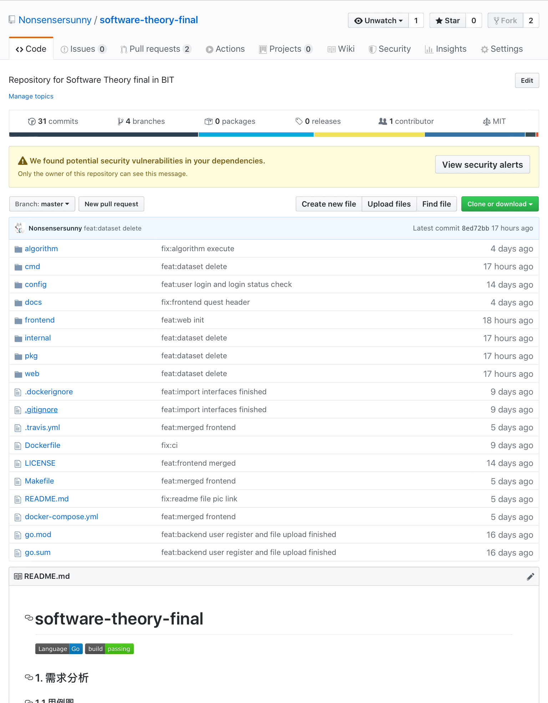

# Conclusion

> ### Innovation

#### 1. Micro-service

- Front & back end separation

  ```shell
  ├── algorithm					# Algorithms
  │   ├── Bayes.py				# Naive Bayes
  │   ├── DecisionTree.py			# Decision Tree
  │   ├── kNN.py					# k-Nearest Neighbor
  │   ├── LogisticRegression.py	# Logitsic Regression
  │   ├── NN.py					# Full-connected Neural Network
  │   ├── RandomForest.py			# Random Forest
  │   ├── requirements.txt		# Python requirement file
  │   ├── SGDC.py					# Stochastic Gradient Descent
  │   └── SVM.py					# Support Vector Machine
  ├── cmd							# Client
  │   └── main.go
  ├── config						# Separated configurations
  │   ├── config.example.yaml
  │   └── config.yaml
  ├── docker-compose.yml			# docker-compose script
  ├── Dockerfile					# Docker build script
  ├── docs						# Documents
  │   ├── images
  │   └── README.md
  ├── go.mod						# Golang dependencies
  ├── go.sum						# Golang dependency check
  ├── internal					# Internal modules
  │   ├── config					# Configuration parser
  │   ├── log						# Customized log
  │   ├── middleware				# Middlewares
  │   └── utils					# Useful tools, i.e. md5
  ├── LICENSE						# MIT License
  ├── Makefile					# Automated script
  ├── pkg							# Indispensible modules 
  │   ├── modules					# Objects definition
  │   ├── rest					# RESTful API definition
  │   └── service					# Service definition
  ├── README.md					# README
  └── web							# Frontend module, auto-generated by vue-cli
      ├── babel.config.js
      ├── package.json			# Frontend dependency record
      ├── package-lock.json
      ├── public					
      ├── README.md
      └── src						# Vue source files
  ```

- RESTful

  ```shell
  PUT    /user/					# Create user
  POST   /user/					# User login
  GET    /user/					# User check login status
  DELETE /user/					# User logout
  PUT    /dataset/				# User upload dataset
  GET    /dataset/				# User get dataset
  DELETE /dataset/				# User delete dataset
  PUT    /algorithm/				# User customize algorithm (still in plan)
  GET    /algorithm/				# Get algorithms provided by system
  POST   /prediction/				# User submit prediction
  GET    /prediction/				# Get prediction record
  DELETE /prediction/				# Delete prediction record
  ```

#### 2. DevOps

- GitHub

  

- Travis

  

#### 3. CI/CD

- Jenkins

  

#### 4. Containerization

- Docker

  

#### 5. Algorithm landing

- Dataset collection

- Selection and realization

> ### Drawbacks

#### 1. Algorithm robustness

- User customized algorithm not supported
- Strict dataset format 

#### 2. System availability

- Build latency

#### 3. System security

- Authentication

#### 4. Developing specification

- Coding style
- Teamwork

> ### Plan

- Algorithm optimization
- Build process simplification
- Documentation
- Practice